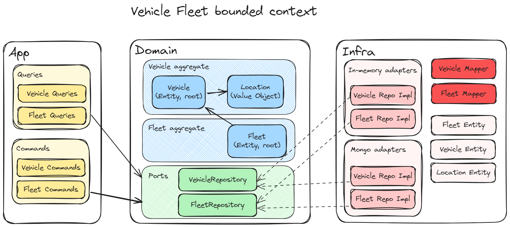

<div align="center">

# Fulll 🤝 Hiring process

**My work for the [Fulll hiring process](https://github.com/fulll/hiring).**

✨ This workspace has been generated by Nx, Smart Monorepos · Fast CI. ✨

</div>

---

## Features

- Fizzbuzz algorithm and CLI (Algo test)
- Vehicle fleet app and CLI (Backend test)
  - DDD architecture
  - CQRS in app layer **only**
- ~6 hours of work on it

## Architecture



This repository is a monorepo managed by [Nx](https://nx.dev/).

It contains libraries for core programs, and client applications to consume these libraries:

- Libraries
  - Fizzbuzz
  - Vehicle Fleet
- Applications
  - Fizzbuzz CLI
  - Fizzbuzz CLI (end-to-end tests)
  - Fleet CLI
  - Fleet CLI (end-to-end tests)

> This way we can imagine creating new applications (like APIs or GUIs) to also consume the libraries.

## Commands

```shell
# Install dependencies
pnpm install

# Lint, test (including e2e) or build all projects
pnpm nx run-many --target=lint
pnpm nx run-many --target=test
pnpm nx run-many --target=build

# Run Fizzbuzz CLI
pnpm run fizzbuzz-cli
pnpm run fizzbuzz-cli -- --args=--max=200

# Run Fleet CLI
# (you need to set environment variable MONGO_URL first)
pnpm run fleet-cli -- --args=create,fleet-1 # example to create a fleet
```

## Q&A

- **For code quality, you can use some tools : which one and why (in a few words) ?**

  I am using ESLint (as part of the Nx workspace) to lint the code during the development and inside the CI.
  I have also prepared a step inside the GitHub action to run a SonarCloud analysis in the CI, but we can
  connect a similar service too (Codecov, Coveralls, etc.). Prettier is also installed to improve code readibility.
  We could also add a pre-commit Git hook to lint the code right before a commit (using husky/lint-staged).

- **You can consider to setup a ci/cd process : describe the necessary actions in a few words**

  At the moment I have created a basic pipeline which runs lint, test and build targets through Nx. This ensures
  that only affected code is processed each commit/PR (very interesting for monorepos like this one).
